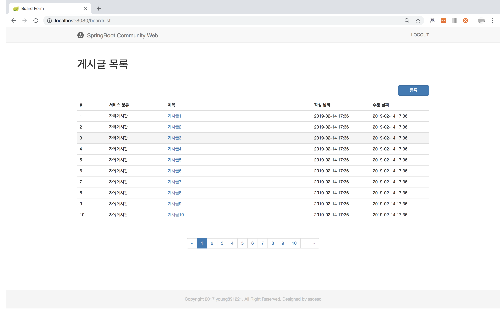
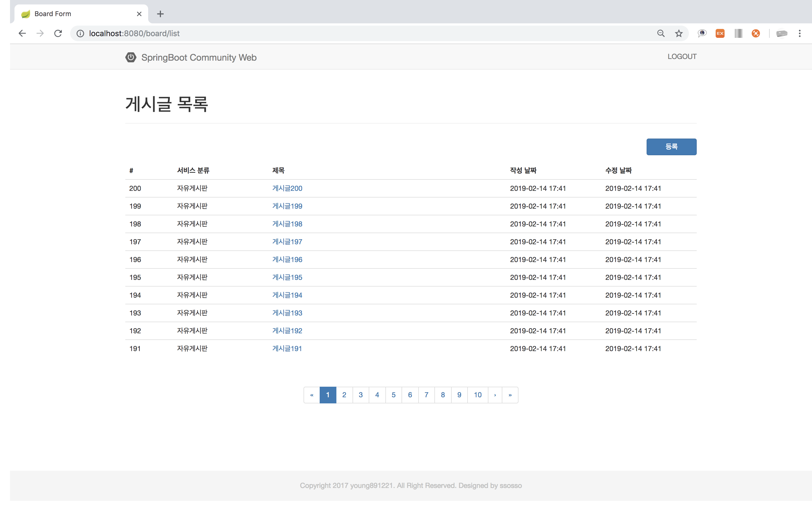
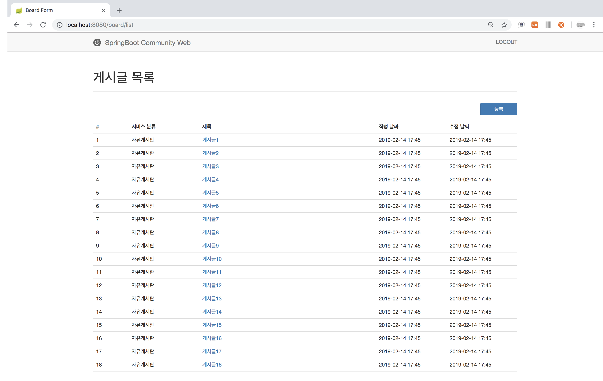
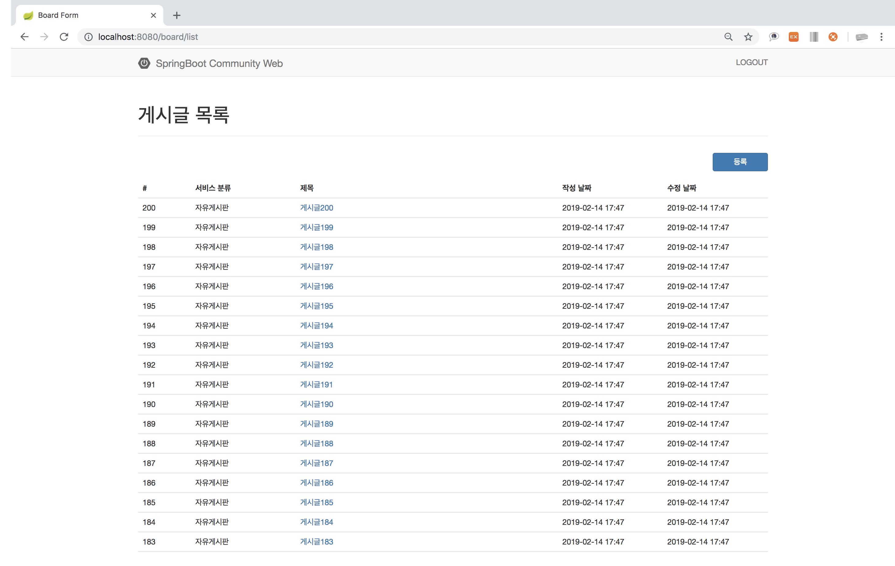

# 게시판 출력

### 1. 페이징 형식 출력
~~~Java
BoardService.java

public Page<Board> findBoardList(Pageable pageable){
    pageable = PageRequest.of(pageable.getPageNumber() <=0 ? 0 : pageable.getPageNumber()-1, pageable.getPageSize());
    return boardRepository.findAll(pageable);
}
~~~

### 2. 페이징 형식 역순 출력
~~~Java
BoardRepository.java

public interface BoardRepository extends JpaRepository<Board, Long>{
    Board findByUser(User user);
    Page<Board> findAllByOrderByIdxDesc(Pageable pageable);
}
~~~
~~~Java
BoardService.java

public Page<Board> findBoardList(Pageable pageable){
    pageable = PageRequest.of(pageable.getPageNumber() <=0 ? 0 : pageable.getPageNumber()-1, pageable.getPageSize());
    return boardRepository.findAllByOrderByIdxDesc(pageable);
}
~~~

### 3. 리스트 형식 출력
~~~Java
BoardController.java

@GetMapping("/list")
public String list(Model model){
    model.addAttribute("boardList", boardService.findBoardList());
    return "/board/list";
}
~~~
~~~java
BoardService.java

public List<Board> findBoardList(){
    return boardRepository.findAll();
}
~~~

### 4. 리스트 형식 역순 출력
~~~java
BoardRepository.java

public interface BoardRepository extends JpaRepository<Board, Long>{
    List<Board> findAllByOrderByIdxDesc();
}
~~~
~~~java
BoardService.java

public List<Board> findBoardList(){
    return boardRepository.findAllByOrderByIdxDesc();
}
~~~

