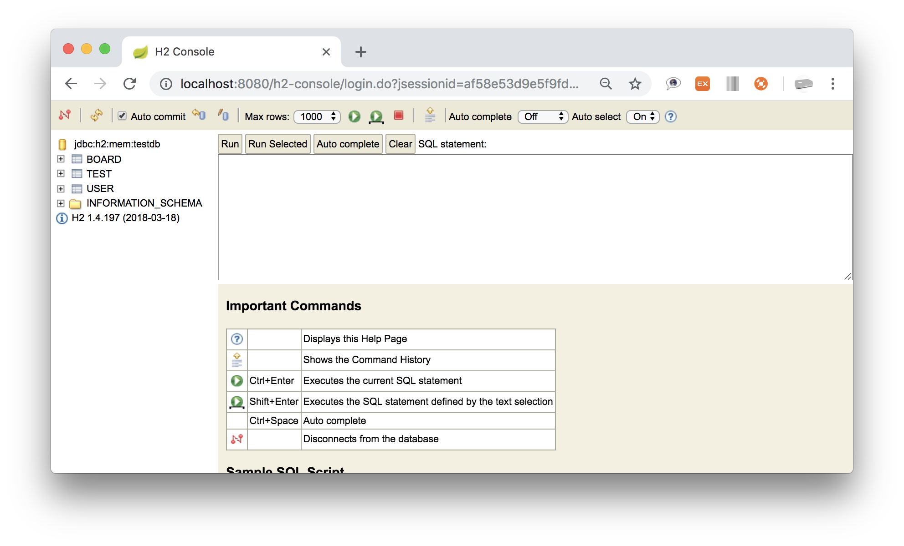

# p104
- [JPA 어노테이션](https://chan180.tistory.com/168)
  1. `@Entity`
  2. `@Table`
  3. `@Id`
  4. `@GeneratedValue`
  5. `@Column`

1. 도메인 클래스에 `@Entity`를 선언시 데이터베이스 테이블이 생성된다.
2. 테스트 도메인 클래스 생성(Test.java, Board.java, User.java)
~~~java
@Getter
@NoArgsConstructor
public class Test {

    @Id
    @Column
    @GeneratedValue(strategy = GenerationType.IDENTITY)
    private Long idx;

    @Column
    private String test;
}
~~~
~~~java
@Getter
@NoArgsConstructor
@Column
public class Board {

    @Id
    @Column
    @GeneratedValue(strategy = GenerationType.IDENTITY)
    private Long idx;

    @Column
    private String board;
}
~~~
~~~java
@Getter
@NoArgsConstructor
@Column
public class User {

    @Id
    @Column
    @GeneratedValue(strategy = GenerationType.IDENTITY)
    private Long idx;

    @Column
    private String user;
}
~~~
3. 테이블 확인
    
4. `@Entity` 추가
~~~Java
@Getter
@NoArgsConstructor
@Entity
public class Test {

    @Id
    @Column
    @GeneratedValue(strategy = GenerationType.IDENTITY)
    private Long idx;

    @Column
    private String test;
}
~~~
5. `Test` 테이블 생성
    
6. `@Table`을 이용한 테이블 이름 수정
~~~Java
@Getter
@NoArgsConstructor
@Entity
@Table(name = "TB_Test")
public class Test {

    @Id
    @Column
    @GeneratedValue(strategy = GenerationType.IDENTITY)
    private Long idx;

    @Column
    private String test;
}
~~~
7. `TB_Test` 생성
  
